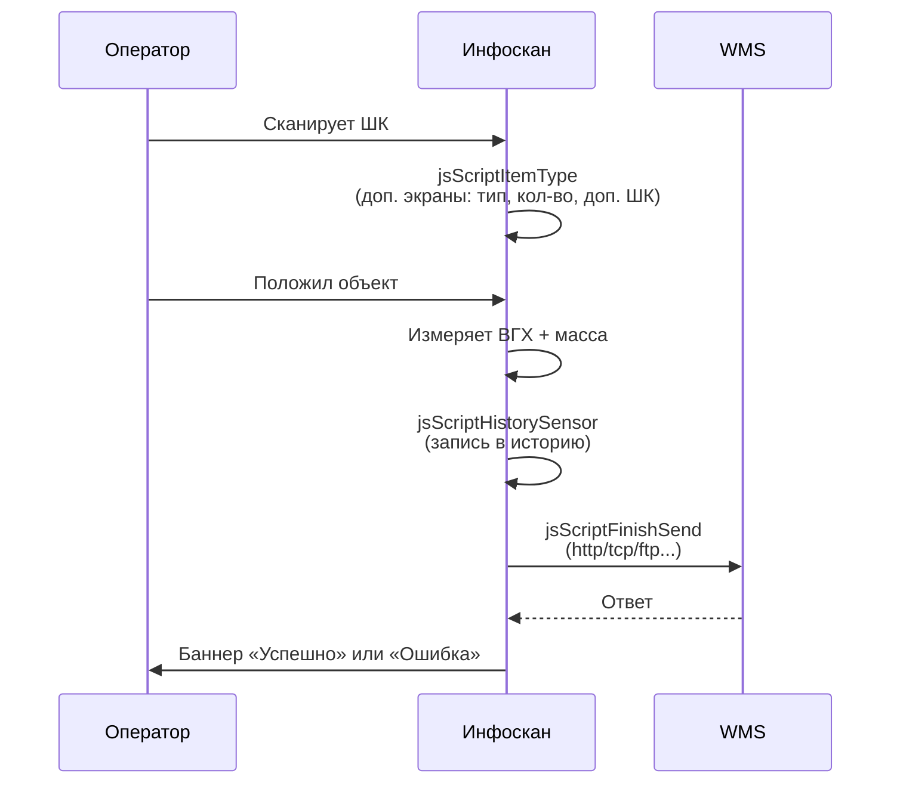

export const metadata = {
  title: 'Архитектура интеграции',
  description: 'Как Инфоскан общается с WMS — модель JS-шаблонов и переменных среды',
}

# Архитектура интеграции

Инфоскан — не «чёрный ящик» со стандартным REST-API. Это **программируемое устройство**: вы загружаете в раздел «Алгоритмы» Личного кабинета устройства JavaScript-шаблоны, и устройство исполняет их в определённые моменты жизненного цикла измерения.

Такая модель даёт максимальную гибкость интеграции — можно подружить Инфоскан с любым WMS, у которого есть хоть какая-то точка приёма данных: REST, SOAP, raw TCP, FTP, файловый обмен.

## Жизненный цикл измерения



## 8 типов шаблонов

| Шаблон | Когда срабатывает | Чаще всего нужен для |
|---|---|---|
| `jsScriptAuthMode` | При запуске устройства / выходе сотрудника | Авторизация по ШК сотрудника, проверка в HR-системе |
| `jsScriptItemType` | До измерения, после скана ШК товара | Доп. экраны: тип упаковки, количество, доп. ШК |
| `jsScriptHttpHandler` | По вызову из других шаблонов | Получение наименования товара по ШК |
| `jsScriptHistorySensor` | После измерения, перед сохранением | Структурирование данных истории |
| `jsScriptFinishSend` | После измерения | **Отправка в WMS — главный шаблон** |
| `jsScriptAction` | По событию (нажатие кнопки на устройстве) | Custom-действия |
| `InfoscanPage` | Конфигурация главного экрана | Кастомизация UI |
| `ScriptScheduler` | По расписанию | Фоновые задачи (синхронизация справочников) |

В 80% интеграций нужно настроить только `jsScriptFinishSend` — отправку результатов в WMS. Остальное — расширения.

## Среда выполнения

В каждом шаблоне доступны глобальные переменные:

- **`BARCODE`** — текущий штрих-код объекта (string).
- **`ADDITIONAL_BARCODES`** — массив дополнительных ШК, считанных в Item Type (string[]).
- **`DEV_CODE`** — уникальный код устройства (string).
- **`UNIQUE_INDEX_HISTORY`** — уникальный индекс текущего измерения (number).
- **`SENSOR.widthFormat / heightFormat / lengthFormat / weightFormat / volumeFormat`** — отформатированные значения с датчиков (string).
- **`HELPER_JS`** — встроенные хелперы (`toBase64`, `xmlToJson`, `xmlXPath`).
- **`GLOBAL_VAR`** — локальное хранилище (память / диск через `storeSchedulerPut`).

Полный справочник — [«Среда выполнения JS-шаблонов»](/06-integration/runtime).

<Callout kind="warning" title="Внимание: lengthFormat vs depthFormat">
Имя переменной длины **зависит от модели**.

- Инфоскан 3D 60 / 3D 90 → `SENSOR.lengthFormat`
- Инфоскан Camera → `SENSOR.depthFormat`

Если пишете один шаблон под несколько моделей — используйте проверку:

```javascript
var len = SENSOR.lengthFormat || SENSOR.depthFormat
```
</Callout>

## Минимальный пример jsScriptFinishSend

Отправка JSON в WMS по HTTP POST:

```javascript
return {
  http: function () {
    return {
      url: 'http://wms.example.ru/measurements',
      headers: {
        'Accept': 'application/json',
        'Content-Type': 'application/json'
      },
      body: function () {
        return JSON.stringify({
          barcode: BARCODE,
          width: SENSOR.widthFormat,
          height: SENSOR.heightFormat,
          length: SENSOR.lengthFormat,
          weight: SENSOR.weightFormat,
          device: DEV_CODE
        })
      },
      resp: function (resp, httpCode) {
        if (httpCode !== 200) {
          throw Error('HTTP ' + httpCode)
        }
        var json = JSON.parse(resp)
        if (json.status !== 'OK') {
          throw Error('Сервис вернул: ' + json.status)
        }
        return {
          banner: BARCODE + ' — записан',
          bannerColor: '#22C55E',
          comment: ''
        }
      }
    }
  }
}
```

## Где это редактировать

Личный кабинет устройства (`http://[IP]/`) → раздел «Алгоритмы» → вкладка `jsScriptFinishSend`. Вставьте код, нажмите «Сохранить» — изменения применяются мгновенно, перезагрузка устройства не нужна.

## Что дальше

- [Среда выполнения JS-шаблонов](/06-integration/runtime) — полный справочник переменных и хелперов.
- [Транспорты](/06-integration/transports) — http, tcp, ftp, file и прочее.
- [Конструктор JS-шаблона](/integration/builder) — собрать шаблон в браузере за 6 шагов.
- [Эмулятор](/emulator) — проверить шаблон в песочнице.
